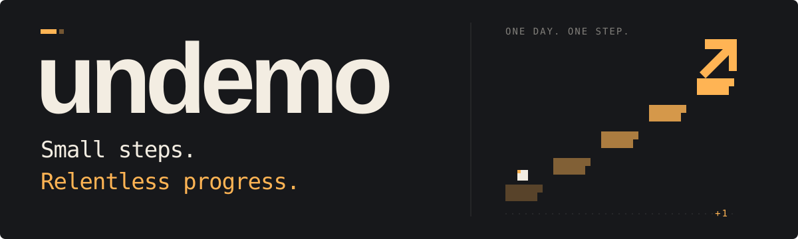
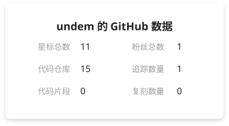

<picture>
  <source media="(prefers-color-scheme: dark)" srcset="./assets/banner-dark.svg" />
  
</picture>

  <b>把想法写成代码，让 AI 走进真实场景。</b> 
  AI Agent · 推荐算法 · 大模型安全 · 游戏实验

  <a href="#精选项目">精选项目</a> ·
  <a href="#技术栈">技术栈</a> ·
  <a href="#github-数据">GitHub 数据</a>

### 精选项目

| 项目 | 我在探索什么 | 技术 |
| :--- | :--- | :--- |
| 🧭 [LifePilot](https://github.com/undemo/lifepilot) | 把生活目标变成可验证、可协同、可恢复的时间线。 | Python · FastAPI · Next.js |
| 🧠 [TAAC 2026](https://github.com/undemo/TAAC2026_best_experiment) | 转化率预测中的兴趣漂移、时间特征与缺失感知建模。 | Python · PyTorch |
| 🛡️ [Defender](https://github.com/undemo/defender) | 模块化大模型防御：交互分析、风险监控与人工审核。 | FastAPI · Vue · TypeScript |
| 🔥 [火会记得](https://github.com/undemo/fire-knows-you) | 暗黑奇幻战术实验：六边形地图、技能与灵魂契约。 | Godot · GDScript |

### 技术栈

  <a href="https://skillicons.dev">
    <picture>
      <source media="(prefers-color-scheme: dark)" srcset="https://skillicons.dev/icons?i=py,pytorch,fastapi,react,vue,ts,godot,git&amp;theme=dark&amp;perline=8" />
      
    </picture>
  </a>

### GitHub 数据

  <a href="https://github.com/undemo?tab=repositories">
    <picture>
      <source media="(prefers-color-scheme: dark)" srcset="./profile/stats-dark.svg" />
      
    </picture>
  </a>
  <a href="https://github.com/undemo?tab=repositories">
    <picture>
      <source media="(prefers-color-scheme: dark)" srcset="./profile/top-langs-dark.svg" />
      
    </picture>
  </a>

<picture>
  <source media="(prefers-color-scheme: dark)" srcset="./profile/snake-dark.svg" />
  
</picture>

  保持好奇，持续构建。 
  Cards by <a href="https://github.com/songquanpeng/stats-cards">stats-cards</a> &amp; <a href="https://github.com/stats-organization/github-readme-stats">GitHub Readme Stats</a> · Animation by <a href="https://github.com/Platane/snk">snk</a>

